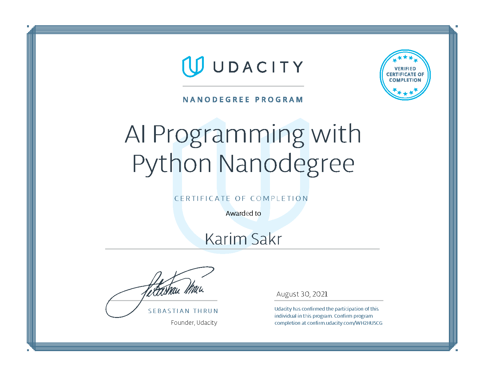

# UDACITY AI Programming with Python Nanodegree

### My implementation of projects for Udacity AI Programming with Python Nanodegree (August 2021).

#### Project 1: [Using a Pre-trained Image Classifier to Identify Dog Breeds](./1.%20Using%20a%20Pre-trained%20Image%20Classifier%20to%20Identify%20Dog%20Breeds/check_images.py) 

* #### Udacity Personalised Project 1 [Review](./Reviews/Review_Dog_Breeds_Classifier.pdf) Passed

#### Project 2: [Create Your Own Image Classifier For Oxford 102 Category Flower Dataset](./2.%20Create%20Your%20Own%20Image%20Classifier%20For%20Oxford%20102%20Category%20Flower%20Dataset/Image%20Classifier%20Project.ipynb)

* #### Udacity Personalised Project 2 [Review](./Reviews/Review_Oxford_Flower_Dataset_Classifier.pdf) Passed

### [Nanodegree Completion Certificate](https://confirm.udacity.com/WH2HU5CG)

